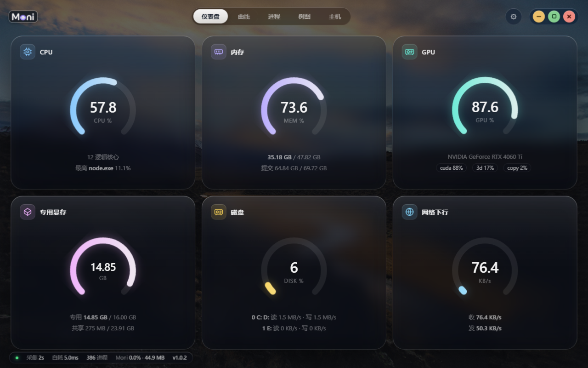
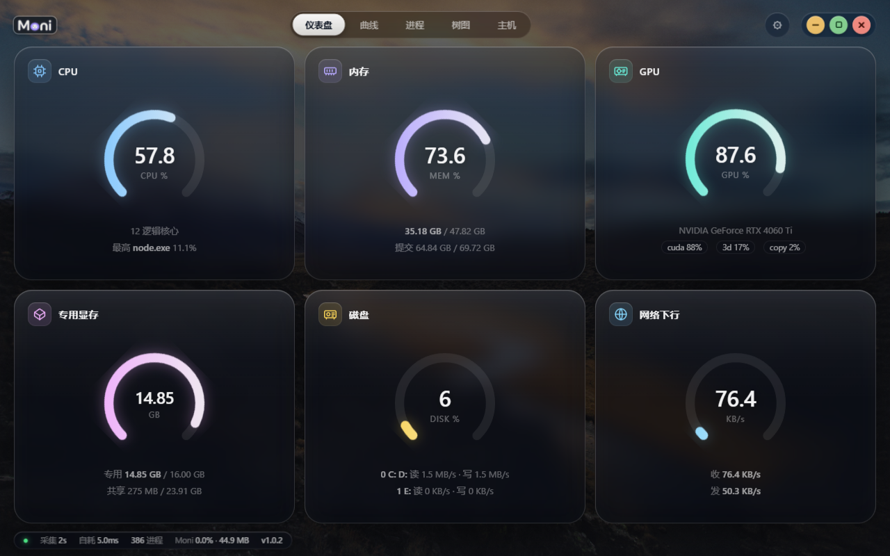
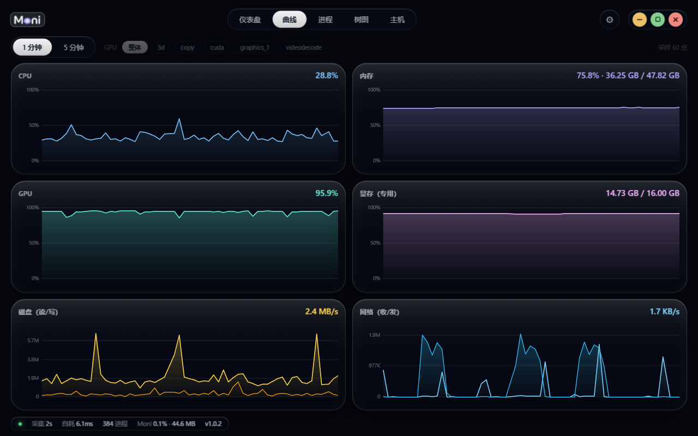
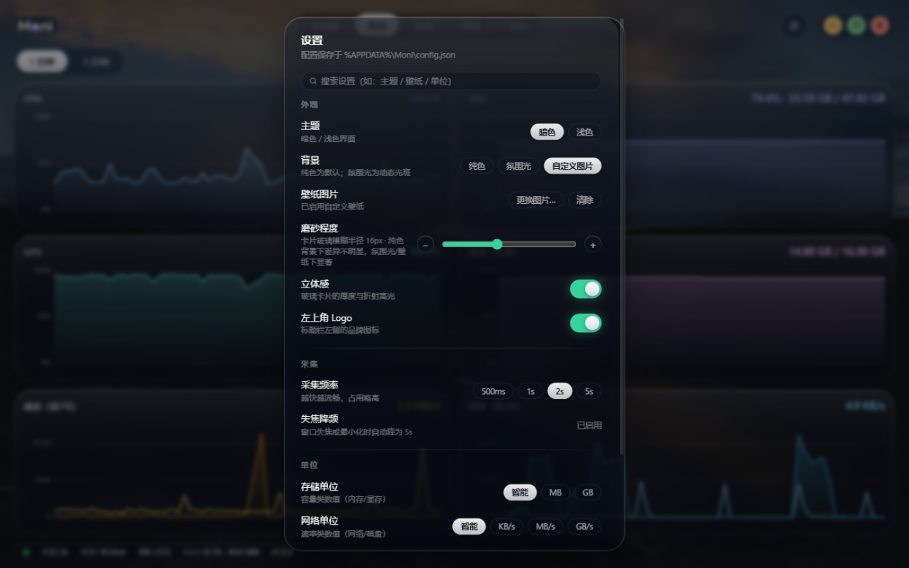

# Moni

<p align="center">
  
</p>

**Moni** 是一个轻量级的 Windows 系统监视器——液态玻璃风格的"任务管理器替代品"。
只读查看，不做任何进程操作；比系统自带任务管理器更轻、更流畅。

## 界面预览

<p align="center">
  
  
  
  
</p>

## 特性

- **六维实时监控**：CPU / 内存 / GPU / 显存 / 磁盘 / 网络，数据与任务管理器同源（PDH / NtQuerySystemInformation），采集自耗 < 10ms
- **进程树**：按父子关系聚合占用（子进程向上累加，与任务管理器分组口径一致），可展开、虚拟滚动、列排序
- **进程搜索与钉选**：按名称 / PID 搜索（与树形同口径聚合展示）；支持把关注的进程钉在顶部独立排序，实时盯着训练 / 服务的占用
- **矩形树图**：squarified 布局，面积 ∝ 占用，支持 CPU/内存/GPU/显存/磁盘五种指标切换与点击下钻
- **历史曲线**：300 点环形缓冲（1s 间隔约 5 分钟），1/5 分钟窗口切换，GPU 引擎分路（3D/Copy/CUDA/编解码）
- **液态玻璃 UI**：无边框窗口 + 自绘标题栏，暗色 / 浅色主题，磨砂程度可调、玻璃立体感增强，背景支持纯色 / 氛围光 / 自定义壁纸，树图六套配色
- **轻量且省心**：单文件 ~12MB 无运行时依赖，自身内存 ~50MB；窗口失焦自动降频至 5s；单实例运行（重复启动自动聚焦）
- **贴心的细节**：状态条显示版本号；关闭按钮可选退出程序或最小化到任务栏；左上角 Logo 可隐藏；设置支持分组与搜索

## 下载

从 [Releases](https://github.com/flynn-desu/Moni/releases) 获取 `Moni.exe`（单文件绿色版，无需安装）。
目标系统需要 WebView2 运行时（Windows 11 自带；Windows 10 一般随 Edge 更新自带，缺失时首次启动会自动引导安装）。

## 从源码构建

依赖：Go 1.25+、Node 20+、[Wails v2 CLI](https://wails.io)（`go install github.com/wailsapp/wails/v2/cmd/wails@latest`）

```bash
wails build -webview2 embed -ldflags "-s -w"
# 产物：build/bin/Moni.exe
```

开发调试：

```bash
wails dev          # 热重载；浏览器打开 http://localhost:34115 可用真实后端联调
cd frontend && npm run dev   # 纯前端调试（自动切换 Mock 数据驱动）
```

## 技术要点

- 采集全部在 Go 原生完成，不派生子进程：`NtQuerySystemInformation` 一次取回全部进程信息，PDH 直读取 GPU 引擎/显存/磁盘/网卡计数器，`GetSystemTimes`/`GlobalMemoryStatusEx` 取全局 CPU/内存
- 前端只消费事件推送，不做轮询；曲线用 uPlot（canvas），树图手写 squarified（canvas），进程表虚拟滚动
- Wails v2 + React + TypeScript，WebView2 渲染

## 已知边界

- 只读监控，不提供结束进程/调优先级等操作
- v1 网络仅全局速率；按进程统计网络需 ETW，留作后续版本
- 部分受系统保护进程显示为 `<受限>`

## 更新日志

### v1.0.3（2026-09-27）

- 修复：Windows PPID 成环导致 200+ 进程（全部 svchost、PyCharm/Python 训练进程等）在进程树中不可见、内存统计对不上
- 新增：进程页搜索（名称 / PID，与树形同口径聚合展示）
- 新增：进程钉选置顶（独立排序、上下调整、进程退出显示幽灵行，切换视图保留）
- 新增：无边框窗口 + 自绘标题栏（最小化 / 最大化 / 关闭，玻璃风彩色圆钮）
- 新增：关闭按钮行为设置（退出程序 / 最小化到任务栏）
- 新增：单实例锁，重复启动自动聚焦已运行窗口
- 新增：玻璃立体感增强（默认开）、磨砂程度 ±1 步进
- 新增：设置分组（外观 / 采集 / 单位 / 窗口）与选项搜索、左上角 Logo 显示开关
- 优化：全新 Logo 与程序图标（小尺寸更清晰）；状态条显示版本号；修复切换视图时玻璃卡片"清晰→模糊"闪烁

### v1.0.2（2026-09-26）

- 背景三选：纯色 / 氛围光 / 自定义壁纸
- 磨砂程度滑杆、内存数值显示、主机页版本号

### v1.0.1（2026-09-26）

- explorer.exe 作为 shell 提升，子进程直接出现在顶层
- 进程 I/O 列口径改名并附说明
- 新增暂停按钮（冻结当前列表，方便查看）

### v1.0.0（2026-09-26）

- 首发：六维实时监控 / 进程树 / 矩形树图 / 历史曲线 / 主机信息

## License

[MIT](LICENSE) © flynn-desu
